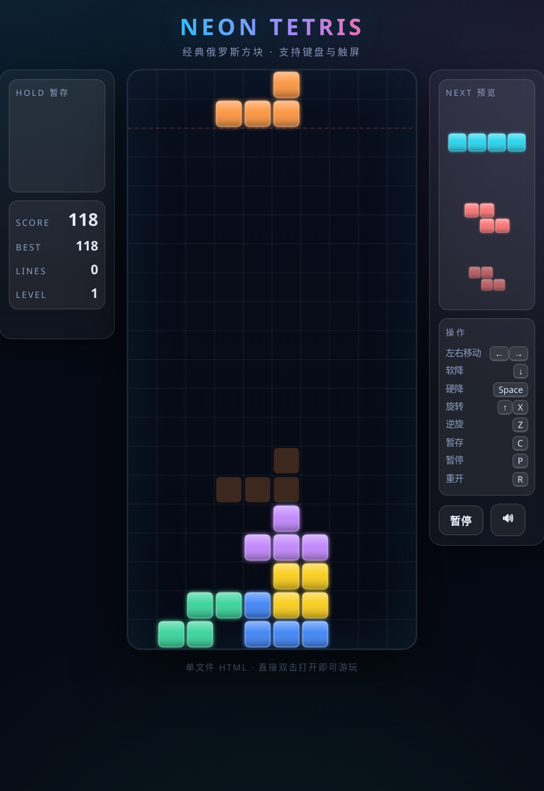

# Neon Tetris · 霓虹俄罗斯方块



A single-file, dependency-free Tetris implementation in vanilla HTML/CSS/JS.
No build step, no frameworks — just open and play.

零依赖的单文件俄罗斯方块，纯 HTML/CSS/JS。打开就能玩，无需构建。

## Features · 特性

- **7-bag randomizer** — fair piece distribution (标准 7 块随机)
- **SRS rotation with wall kicks** — JLSTZ and I-piece kick tables (符合 SRS 规范的旋转与踢墙)
- **Hold piece** + **Next×3 preview** (暂存 + 下一个×3 预览)
- **Ghost piece** — see where it will land (幽灵落点指示)
- **Lock delay 480ms** with move-resets (锁定延迟 + 移动重置)
- **Hard drop, soft drop, 180° flip** (硬降、软降、180° 翻转)
- **T-Spin detection** with combo scoring (T-Spin 判定与连击加分)
- **Level / line counter / best score** persisted in `localStorage`
- **Keyboard + touch** controls with DAS/ARR (键盘 + 触屏，含长按重复)
- **Sound effects** (WebAudio, can be muted) (音效，可静音)
- **Neon dark theme** with glow & glassmorphism (霓虹暗色主题)

## Controls · 操作

| Action | Keyboard | Touch |
|---|---|---|
| Move | ← / → | ◀ ▶ |
| Soft drop | ↓ | ▼ |
| Hard drop | Space | 硬降 |
| Rotate CW | ↑ / X | ↻ |
| Rotate CCW | Z | ↺ |
| 180° flip | A | — |
| Hold | C / Shift | 暂存 |
| Pause | P / Esc | 暂停 |
| Restart | R | — |

## Files · 文件结构

```
.
├── index.html      ← entry point (same game, for GitHub Pages root)
├── tetris.html     ← identical game under explicit name
├── preview.png     ← screenshot used in this README
├── README.md
└── .gitignore
```

## Deploy to GitHub Pages · 部署到 GitHub Pages

1. Create a new GitHub repository (public).
2. Drag **all the files above** into the repo (via the web UI's *Add file → Upload files*).
3. Commit.
4. Go to **Settings → Pages**:
   - **Source**: `Deploy from a branch`
   - **Branch**: `main` / `root`
   - Save.
5. Your game will be live at `https://<your-username>.github.io/<repo-name>/` within ~1 minute.

## Run locally · 本地运行

Just double-click `index.html` (or `tetris.html`) in any modern browser.
No server required. Works fully offline.

双击 `index.html`（或 `tetris.html`）即可在任意现代浏览器中打开，完全离线可用。

## License · 许可

MIT — do whatever you like.
